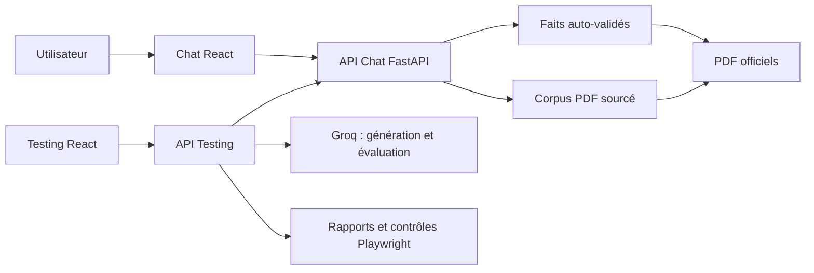

# MyFinance

> Assistant d’analyse d’états financiers bancaires, fondé sur des preuves officielles et vérifié par une plateforme de tests autonome.

MyFinance ne répond pas à partir d’estimations. Chaque réponse chiffrée est construite à partir d’un fait financier validé, relié à un extrait et au PDF officiel d’origine. Lorsqu’une information est ambiguë ou absente, l’application clarifie ou refuse de conclure.

## Ce que le projet démontre

| Besoin | Réponse MyFinance |
| --- | --- |
| Retrouver un indicateur bancaire | Valeur validée avec banque, exercice, unité et preuve PDF |
| Comprendre un passage du rapport | Analyse documentaire avec extraits sourcés et pages associées |
| Éviter une réponse fragile | Clarification ou non-conclusion, jamais de chiffre inventé |
| Vérifier le produit | Campagnes API, rapports d’audit et parcours Playwright visibles |

Le périmètre actuel couvre les états financiers individuels 2021–2025 d’Amen Bank, Attijari Bank, BIAT, Banque de Tunisie et Banque Zitouna.

## Architecture



La frontière est volontairement nette : `chat/` sert l’utilisateur, `autotest/` le vérifie, `shared/` porte les contrats et `data/` conserve les preuves.

## Démarrage local

Prérequis : Python 3.12+, [uv](https://docs.astral.sh/uv/), Node.js 20+ et, pour les campagnes qualitatives, une clé Groq.

```powershell
uv sync --all-groups
```

Lancez ensuite les services dans des terminaux séparés :

```powershell
# 1 — API du Chat : http://127.0.0.1:8000
uv run python chat/scripts/run_orchestrator.py

# 2 — Interface du Chat : http://127.0.0.1:3000
cd chat/web
npm install
npm run dev:chat

# 3 — API Testing : http://127.0.0.1:8001
$env:GROQ_API_KEY = "votre-cle"
uv run python autotest/scripts/run_testing_api.py

# 4 — Interface Testing : http://127.0.0.1:3001
cd autotest/web
npm install
npm run dev:testing
```

Commencez la démo dans le Chat, puis ouvrez Testing pour lancer une campagne et consulter sa synthèse ou son audit détaillé. Le déroulé complet est dans le [guide de démonstration](docs/demo.md).

## Qualité et vérification

```powershell
uv run ruff check .
uv run pytest -q

cd chat/web
npm run test:e2e
```

Les résultats Playwright, campagnes, captures et bases SQLite sont des traces locales : ils sont volontairement exclus de Git.

## Organisation du dépôt

| Dossier | Responsabilité |
| --- | --- |
| [chat/](chat/README.md) | API de conversation, interface utilisateur, corpus et tests E2E |
| [autotest/](autotest/README.md) | Campagnes Agentic Testing, Groq, rapports et interface de suivi |
| [shared/](shared/) | Contrats Python échangés entre les applications |
| [data/](data/README.md) | PDF officiels, corpus, références métier et faits validés |
| [docs/](docs/README.md) | Architecture, modèle de données, décisions et démo |

## Documentation et contribution

- [Architecture](docs/architecture.md)
- [Modèle de données](docs/data-model.md)
- [Guide de démonstration](docs/demo.md)
- [Cycle agile et règles de contribution](CONTRIBUTING.md)

Les documents financiers et le corpus sont des éléments de preuve. Ne supprimez pas de données dans `data/` sans validation métier explicite.
