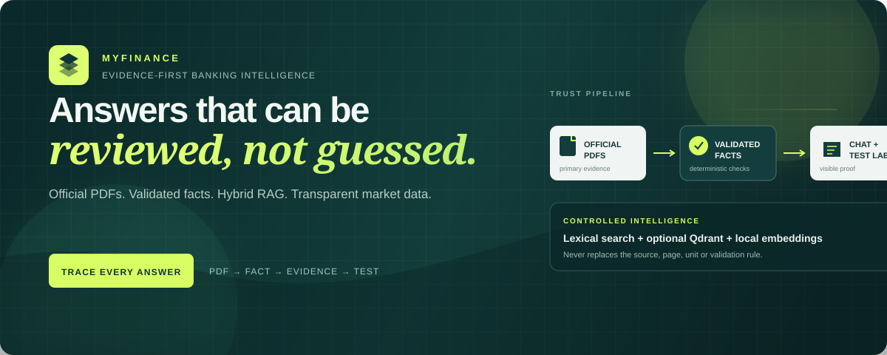
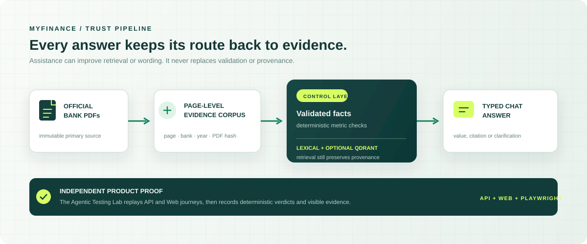
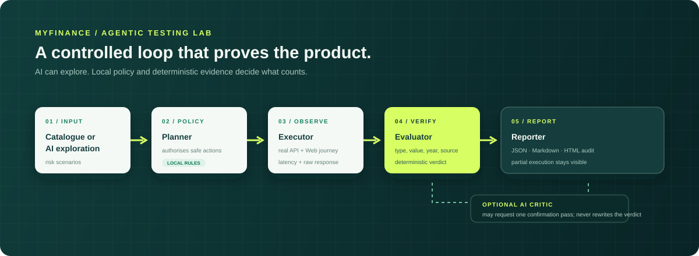

<p align="center">
  
</p>

<p align="center">
  <a href="#see-the-product-in-one-minute"><strong>Quick start</strong></a>
  &nbsp;·&nbsp;
  <a href="docs/user-guide.md"><strong>User guide</strong></a>
  &nbsp;·&nbsp;
  <a href="docs/architecture.md"><strong>Architecture</strong></a>
  &nbsp;·&nbsp;
  <a href="docs/operations-guide.md"><strong>Operations</strong></a>
  &nbsp;·&nbsp;
  <a href="docs/demo.md"><strong>Demo flow</strong></a>
</p>

# MyFinance

> **Evidence-first banking intelligence for Tunisian financial reports.**
>
> MyFinance answers financial questions only when it can show the official evidence behind the answer: the bank, reporting year, unit, PDF page and source excerpt.

> [!IMPORTANT]
> **The project does not optimise for a plausible answer. It optimises for a reviewable one.**

MyFinance is not a generic financial chatbot. It is a local, evidence-controlled research workspace built around official bank reports, an optional hybrid RAG layer, official market snapshots and an independent Agentic Testing lab.

| Current verified scope | Coverage |
| --- | --- |
| Institutions | Amen Bank, Attijari Bank, BIAT, Banque de Tunisie and Banque Zitouna |
| Individual financial reports | 2021–2025 (25 reports) |
| Automatically validated facts | 175 facts across 7 comparable metrics |
| User experiences | Financial Chat and Agentic Testing Lab |
| Evidence channels | Official PDFs, page-level corpus, validated facts and official Market Watch snapshots |

## Why MyFinance is different

| A conventional assistant may… | MyFinance does instead |
| --- | --- |
| infer a number from prose | shows a value only when it is an `auto_validated` financial fact |
| cite a document without locating the evidence | keeps the PDF, page, excerpt, year, unit and reporting scope attached to the answer |
| treat semantic search as truth | uses Qdrant to improve retrieval, then verifies provenance and deterministic rules |
| make an unsupported comparison | compares only compatible validated values for the requested period |
| hide a data or service failure | returns an explicit clarification or availability notice |
| test only an API | validates API contracts, the real web interface and live Playwright journeys |

## See the product in one minute

### 1. Start the local stack

Open PowerShell in the repository root. Docker Desktop must already be running.

```powershell
Copy-Item .env.example .env
.\scripts\myfinance.ps1 start
```

The first start may take several minutes because Docker builds the images, Ollama downloads the local embeddings model and Qdrant receives its first vector index. Later starts reuse the existing images, model and index.

### 2. Open the two applications

| Application | Address | Purpose |
| --- | --- | --- |
| MyFinance Chat | <http://localhost:3000> | Ask financial, documentary and market questions |
| Agentic Testing Lab | <http://localhost:3001> | Run release validation, inspect campaigns and watch Playwright |

During a running **Chat Visual Check** only, you may open <http://localhost:6080> to watch the real Playwright browser. It is an optional observer window, not a third application to keep open during normal use.

### 3. Try the evidence contracts

```text
What is the PNB of BIAT in 2023?
Compare BIAT, BT and Amen Bank's current share prices.
How many shares made up BIAT's share capital in 2025?
What does BIAT's 2021 report say about related-party transactions?
```

Each question demonstrates a different response contract: validated value, official market comparison, documentary evidence or a safe clarification.

> **Groq is optional for core financial safety.** Add `GROQ_API_KEY` to `.env` only to enable AI exploration, qualitative review and optional source-grounded phrasing. It never becomes the authority for a financial number.

## The trust model

<p align="center">
  
</p>

The critical rule is simple: **a PDF is the primary source; a validated fact is the only source allowed to produce a financial number.** Qdrant and Groq can improve retrieval or wording, but neither can override that rule.

## What the Chat can answer

| Response | When it is used | What the user sees |
| --- | --- | --- |
| **Automatically validated value** | A supported metric, bank and year match an approved fact | Value, scale, currency, financial year, PDF page and excerpt |
| **Comparison view** | Compatible facts exist for two or more banks | Ranked values, range, ratio and source count |
| **Documentary answer** | The user asks about a report topic rather than a validated metric | Source-grounded explanation with retrieved excerpts and pages |
| **Market Watch** | The user requests a current official share price or comparison | Dated quote, session move, ticker, ISIN and official link |
| **Clarification / refusal** | Scope, evidence or supported data is missing | The minimum information needed; never an invented value |

### Conversation context is intentional

The Chat remembers a selected bank or a previously stated financial metric only when that context is unambiguous. For example, selecting **Banque Zitouna** asks for a metric and year; it does not silently assume the latest report. Unknown bank names and incomplete comparisons are stopped before they can reuse an unrelated previous answer.

## The two product surfaces

### Financial Chat — `chat/`

The Chat is the user-facing application. It combines a FastAPI API, React interface, financial-fact catalogue, documentary retrieval, Market Watch reader and explicit conversation state.

Its job is not to sound confident. Its job is to make the answer inspectable.

### Agentic Testing Lab — `autotest/`

The Testing Lab treats the Chat as a product that must be proved continuously:

<p align="center">
  
</p>

- **Release validation** replays reproducible facts, API ↔ Web agreement and behaviour contracts.
- **AI exploration** proposes additional edge cases through Groq but keeps them separate from deterministic release checks.
- **Visual checks** drive the real Chat interface with Playwright. While one is running, its browser can optionally be observed at port `6080`.
- Campaigns can be stopped, resumed where applicable and deleted locally. A partial execution is clearly marked instead of being presented as a full success.

## Hybrid RAG, without giving up evidence

MyFinance has two documentary retrieval paths:

1. **Lexical, page-level retrieval** is always available and remains the safe fallback.
2. **Qdrant semantic retrieval** enriches recall by searching vector embeddings created locally with `nomic-embed-text` through Ollama.

Both paths return chunks that still carry bank, report year, PDF page, source path and PDF hash. If Qdrant, Ollama or the vector index is unavailable, the Chat continues using lexical retrieval; it does not fabricate an answer and it does not block the rest of the product.

Rebuild the index only after changing the source corpus or validated data:

```powershell
.\scripts\myfinance.ps1 reindex
```

## Local services

| Service | Role | Local address |
| --- | --- | --- |
| `chat-web` | React Chat interface | `localhost:3000` |
| `chat-api` | Conversation and evidence API | `localhost:8000` |
| `testing-web` | Testing Lab interface | `localhost:3001` |
| `testing-api` | Campaign orchestration, SSE and local reports | `localhost:8001` |
| `testing-viewer` | Optional headed Playwright observer, useful only during a visual check | `localhost:6080` |
| `qdrant` | Optional semantic evidence index | `localhost:6333` |
| `ollama` | Local embeddings provider | `localhost:11434` |
| `market-collector` | Official Market Watch snapshot collector every 30 minutes | internal background service |

All Docker ports except the local Ollama endpoint are bound to `127.0.0.1` by default. The project is designed for local development and internal demonstration, not for direct public exposure.

## Repository map

```text
myfinance6.5/
├── chat/                 Financial Chat: API, evidence engine, market reader and React UI
├── autotest/             Agentic Testing: campaigns, evaluators, Playwright and dashboard
├── shared/contracts/     Pydantic contracts shared across applications
├── data/                 Official PDFs, corpus, facts, reference catalogues and local artefacts
├── docker/               Dockerfiles and SPA configuration
├── scripts/              PowerShell start, status, reindex and stop commands
├── docs/                 Product, architecture, operations and development documentation
└── .github/workflows/    Quality gate executed on `main` and pull requests
```

## Quality gates

```powershell
uv run ruff check .
uv run pytest -q

Set-Location chat/web
npm run test:e2e
```

GitHub Actions repeats the Python checks and builds both web applications on `main` and on pull requests. Generated campaign reports, Playwright artefacts, screenshots, SQLite files, embeddings and secrets are deliberately excluded from Git.

## Documentation map

Start here depending on your role:

| I want to… | Read |
| --- | --- |
| Understand the product and answer types | [User guide](docs/user-guide.md) |
| Present the project in a meeting or demo | [Demo guide](docs/demo.md) |
| Understand the complete system | [Architecture](docs/architecture.md) |
| Understand the documentary RAG pipeline | [RAG pipeline](docs/rag-pipeline.md) |
| Run, maintain or troubleshoot Docker | [Operations guide](docs/operations-guide.md) |
| Extend the code safely | [Developer guide](docs/developer-guide.md) |
| Add a bank report, metric or vector index | [Data coverage and onboarding](docs/data-coverage.md) |
| Review the evidence model | [Data model](docs/data-model.md) |
| Review security boundaries | [Security and deployment](docs/security-and-deployment.md) |
| Navigate all documents | [Documentation home](docs/README.md) |

## Scope and honest limits

- The current corpus covers the five listed banks and individual reports only; it is not a general market-data terminal.
- A report topic can be explained only when evidence is found in the local corpus.
- Current share prices are tied to the official Market Watch reading and its capture time; a stale or unavailable source is reported explicitly.
- Groq must be configured with a valid API key for AI exploration and qualitative criticism. Deterministic release validation remains meaningful without it.
- Public deployment requires HTTPS, authentication, a shared rate limit, secret management and private internal services. See the [security guide](docs/security-and-deployment.md).

---

**MyFinance makes the answer reviewable, not merely plausible.**
