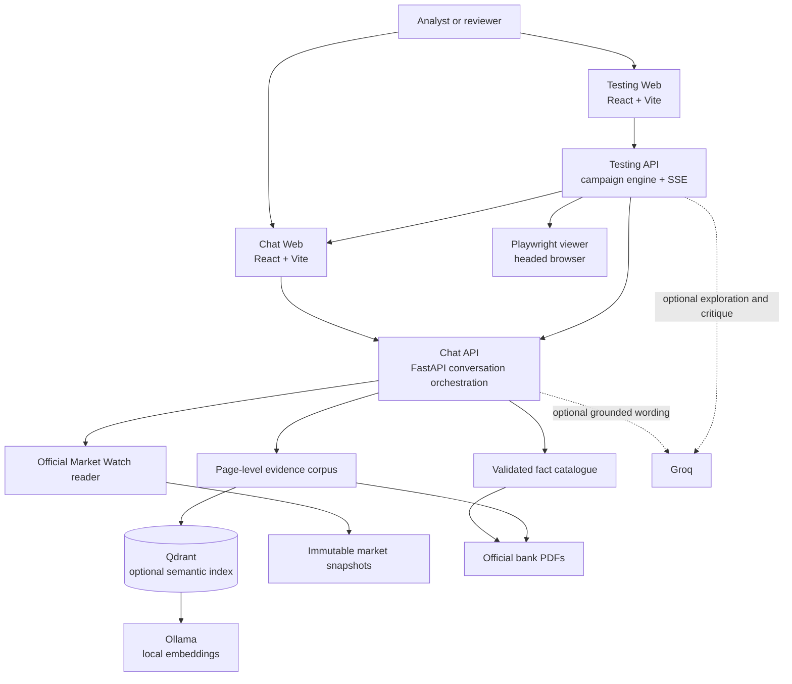
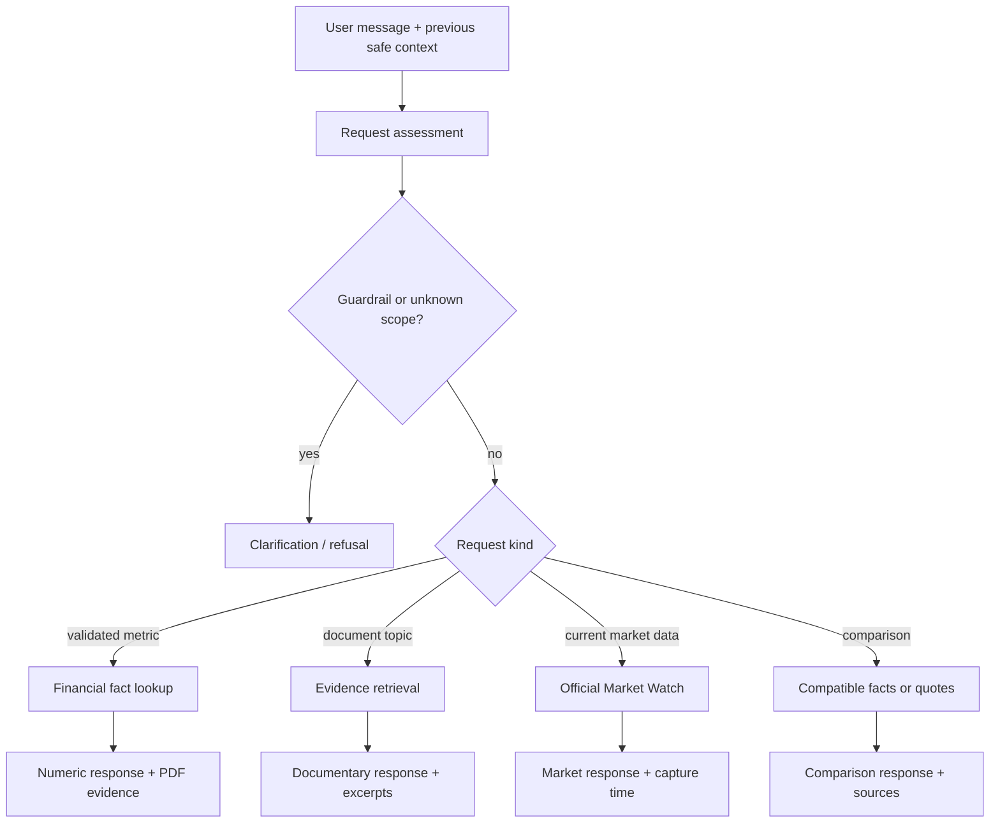
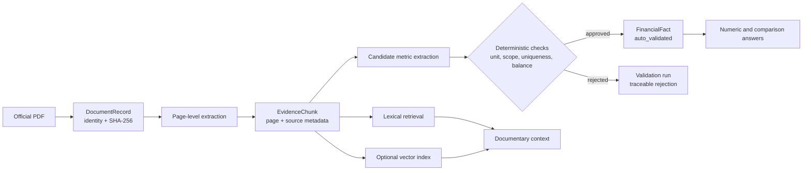

# System Architecture

## 1. Architectural thesis

MyFinance is built around one constraint: **a financial answer must be inspectable all the way back to an official source.** The system therefore separates source material, deterministic validation, retrieval assistance, conversation orchestration and product verification.

The result is deliberately different from a general LLM application. A language model may assist with question interpretation, optional source-grounded wording or test exploration. It cannot select a numeric value, replace a source, bypass a guardrail or convert an unsupported answer into a fact.

## 2. System at a glance

## 3. Boundaries and responsibilities

| Boundary | Owns | Must never do |
| --- | --- | --- |
| `data/raw` | Immutable official PDFs | Contain generated answers or API secrets |
| `chat/knowledge` | Corpus, metric definitions, fact extraction and validation | Present an unvalidated candidate as a reported value |
| `chat/api` | Request assessment, conversation context, guardrails and typed response | Trust an LLM as a financial source |
| `chat/market` | Official quote reading, snapshots and freshness | Substitute a report value for a market price |
| `chat/web` | Evidence-first user experience | Invent a value on the client side |
| `autotest` | Scenario control, execution evidence, evaluation and reports | Change Chat source data to make a test pass |
| `shared/contracts` | Stable Pydantic shapes exchanged across packages | Hold bank-specific business logic |

## 4. The answer router

Every Chat request first goes through deterministic assessment: known bank, reporting year, metric, market intent, safety constraints and active conversation context. It then takes one of the paths below.

### Numeric facts

A numeric answer is valid only when a matching `FinancialFact` has `validation_status=auto_validated`. It carries at least the bank, metric, reporting year, published value, scale, currency, source document, page number and source excerpt.

### Documentary answers

Documentary questions are answered from page-bounded `EvidenceChunk` records. The response is explanatory rather than numeric unless a separate validated fact is available. The evidence list remains visible to the user.

### Market answers

Current quotes come from the official Tunis Stock Exchange Market Watch workflow and are labelled with capture time and delay information. Market data stays separate from annual-report data. If the official source cannot be read or is stale, the system shows an availability notice rather than a substitute value.

### Clarifications

Clarifications are a product feature, not an error state. They prevent unsupported scope from becoming an answer. Typical examples are an unknown bank, a missing reporting year, a comparison without a criterion, or an unavailable year.

## 5. Evidence pipeline

### Why Qdrant is an enrichment, not a replacement

Qdrant stores embeddings of evidence chunks. It can surface a semantically relevant page when the user’s words do not exactly match a report’s language. It does not contain a new source of truth and it does not waive bank/year/page/provenance filters. If it is unavailable, lexical retrieval continues.

## 6. Agentic Testing architecture

The Testing Lab is independent from the Chat’s answer generation. It observes the Chat through its real API and, where selected, its real web interface.

| Stage | Responsibility | Authority |
| --- | --- | --- |
| Catalogue / AI Generator | Supplies reproducible scenarios or optional new edge cases | Never sends arbitrary actions directly |
| Planner | Authorises only allowed local Chat messages | Local policy is authoritative |
| Executor | Calls the Chat API and optional web interface | Retains raw response, latency and transport evidence |
| Evaluator | Checks response type, value, year, source and safety contracts | Deterministic verdict is authoritative |
| AI Critic | Requests a confirmation pass when an anomaly merits it | Optional; cannot override deterministic evidence |
| Reporter | Produces JSON, Markdown and HTML reports | Records the observed campaign state |

The Testing dashboard also exposes stack health: Chat API, Qdrant collection, embeddings model and market collector freshness. A degraded component is shown as degraded rather than silently treated as ready.

## 7. Runtime topology

| Docker service | Depends on | Reads/writes |
| --- | --- | --- |
| `chat-api` | Qdrant | Reads source data read-only; serves conversation API |
| `chat-web` | Chat API | Serves compiled React UI |
| `testing-api` | Chat API, testing viewer | Writes local campaign reports; runs API/Web checks |
| `testing-web` | Testing API | Serves dashboard build |
| `testing-viewer` | — | Displays headed Playwright browser locally |
| `qdrant` | — | Persists semantic vectors in Docker volume |
| `ollama` | — | Persists local embedding model in Docker volume |
| `market-collector` | — | Writes immutable snapshots and collector health locally |
| `vector-index` | Qdrant, Ollama | One-shot job that rebuilds vectors from existing chunks |

## 8. Designed failure behaviour

| Condition | Safe behaviour |
| --- | --- |
| Qdrant unavailable | Continue with lexical evidence retrieval |
| Ollama/model unavailable | Keep numeric facts and lexical retrieval available; semantic indexing is unavailable |
| Groq key missing, invalid or quota-limited | Preserve deterministic Chat and release validation; mark AI exploration/critique unavailable |
| Market Watch unavailable | Show an explicit official-quote availability notice |
| No validated fact for the requested scope | Clarify or abstain; never estimate |
| Executor transport issue | Record the request as unavailable and display a partial-execution warning if other requests completed |

## 9. How to evolve the architecture safely

1. Add source data and validation first; do not begin in the UI.
2. Keep `shared/contracts` backwards-compatible when changing API response shapes.
3. Add a deterministic test for each new fact, guardrail or conversation transition.
4. Reindex Qdrant only when corpus content changes.
5. Use AI exploration to discover risk cases, then turn confirmed cases into reproducible regression tests.
6. Keep all internal data services private when deploying beyond local development.

For implementation detail, continue with the [Developer guide](developer-guide.md). For operations, continue with the [Operations guide](operations-guide.md).
