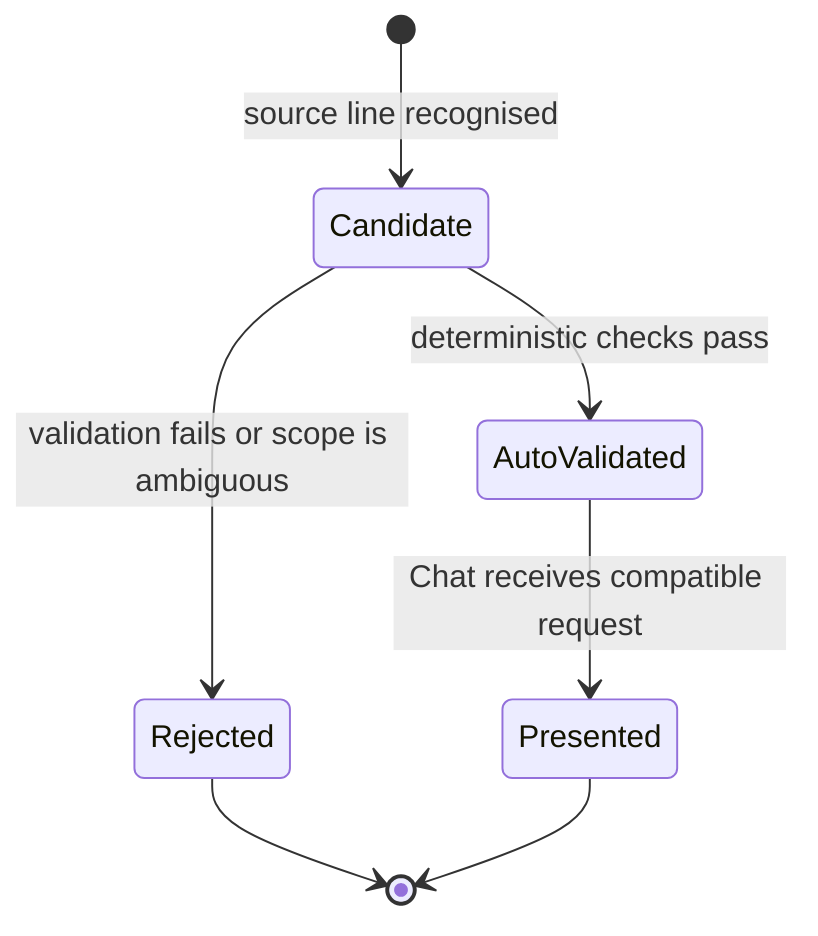

# Evidence and Data Model

## 1. The provenance chain

```text
Official PDF
  → DocumentRecord
  → EvidenceChunk (one page at a time)
  → candidate metric extraction
  → FinancialFact: auto_validated or rejected
  → typed Chat response
```

Each object exists to answer a different question: *what is the source*, *where is the evidence*, *has the number been approved*, and *what may the product show to a user*.

## 2. Primary records

| Record | Core fields | Purpose |
| --- | --- | --- |
| `DocumentRecord` | bank, reporting year, source path, SHA-256, page count | Immutable identity of one official PDF |
| `EvidenceChunk` | bank, year, page, section, text, source path, document hash | Page-bounded documentary retrieval and citation |
| `FinancialFact` | bank, metric, value, unit, currency, scope, year, page, excerpt, validation status | Normalised published value with reviewable evidence |
| `ConversationContext` | mode, bank, year, metric, comparison/market selection and topic | Minimal safe continuity between Chat messages |
| Market snapshot | instrument, quote, session move, capture time, source reference | Dated official market observation |
| Campaign record | configuration, events, scenarios, raw executions, verdicts and report paths | Local proof of a Testing Lab run |

## 3. FinancialFact lifecycle



Only `AutoValidated` reaches a numeric Chat answer. An evidence chunk may explain a report passage, but cannot promote itself to a number.

## 4. Important semantics

### Bank and reporting perimeter

Every fact belongs to a bank and financial year. The reporting perimeter matters: an individual report must not be confused with a consolidated statement, and a previous-year comparative column must not be presented as the requested year.

### Unit and currency

Values are not meaningful without scale. `1,396,872 thousand TND` is not rendered or compared as if it were `1,396,872 TND`. The published unit and currency remain in the contract.

### Page and excerpt

The source page and excerpt are not decoration. They allow a reviewer to inspect the exact statement line rather than trusting a visual chart or a model summary.

### Validation status

| Status | Product meaning |
| --- | --- |
| `candidate` | Internal extraction possibility; not user-visible as a fact |
| `auto_validated` | Approved for numeric answer and comparison use |
| rejected/invalid | Retained for traceability; never used in a response |

## 5. ConversationContext rules

The context serialised by the Chat is intentionally narrow. It may retain an explicit bank, year or metric that a subsequent message can safely refine. It must not retain an implicit source year from a bank-identity response or use a prior comparison to interpret an unknown bank identifier.

This is why selecting a bank asks for a metric and year instead of silently assuming the newest report, and why an incomplete comparison asks for its criterion.

## 6. Retrieval model

```text
EvidenceChunk metadata
  bank + year + page + section + document hash
       ├── lexical retrieval (always available)
       └── Qdrant vector retrieval (optional enrichment)
                ↓
       provenance-filtered evidence set
                ↓
       documentary response with citations
```

Both retrieval paths use the same evidence model. Qdrant never becomes the source; it stores representations of already sourced chunks.

## 7. Testing artefacts

The Testing Lab keeps a separate audit model:

- planned action and planner rationale;
- raw API/Web execution, latency and transport error;
- deterministic evaluator checks and verdict;
- optional Groq critic decision;
- final JSON, Markdown and HTML report paths.

This allows a campaign to say exactly what happened: a factual rule failure, a provider limitation, an unavailable transport response or an intentionally skipped optional stage.

For current dataset scope, read [Data coverage](data-coverage.md). For code locations, read the [Developer guide](developer-guide.md).
