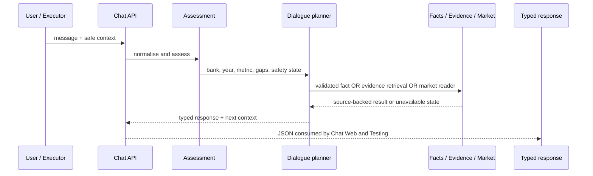

# Developer Guide

## 1. Development principle

MyFinance is an evidence system first and an AI application second. A safe change keeps these responsibilities separate:

```text
source material → deterministic validation → typed contract → Chat experience → independent product testing
```

Do not solve a data-quality problem in the UI, and do not solve a conversation problem by weakening a source-validation rule.

## 2. Repository map

| Path | Responsibility | Primary entry points |
| --- | --- | --- |
| `shared/contracts/src/` | Pydantic request, response, evidence and runtime-security contracts | `myfinance_contracts` |
| `chat/api/src/` | FastAPI routes, assessment, dialogue state machine and safeguards | `myfinance_orchestrator.main` |
| `chat/knowledge/src/` | Catalogue, corpus, validated facts, retrieval and vector-store adapter | `myfinance_agent_docs` |
| `chat/market/src/` | Official Market Watch reading, snapshots, availability and collector | `myfinance_agent_market` |
| `chat/web/` | React Chat interface and Playwright journeys | `npm run dev:chat`, `npm run test:e2e` |
| `autotest/api/` | FastAPI campaign API, persistence, SSE and visual-check controls | `myfinance_testing_api.main` |
| `autotest/src/` | Scenario generation, planning, execution, evaluation, critic and reports | `myfinance_autotest` |
| `autotest/web/` | React testing dashboard | `npm run dev:testing` |
| `data/` | Source PDFs, normalised corpus, fact catalogue and reference policies | See [data README](../data/README.md) |
| `docker/`, `scripts/` | Runtime packaging and PowerShell operations | `myfinance.ps1` |

## 3. Core contracts

The shared package is the boundary between components. The most important models are:

| Contract | Meaning |
| --- | --- |
| `ConversationRequest` | A user message plus serialisable conversation context |
| `ConversationContext` | Safe remembered state: bank, year, metric, mode and scoped comparison/market information |
| `RequestAssessment` | Deterministic extraction of banks, years, metric and missing information |
| `DocumentRecord` | Immutable identity of an official PDF, including hash and page count |
| `EvidenceChunk` | Page-bounded source text and provenance metadata |
| `FinancialFact` | Normalised metric with value, unit, scope, source page and validation status |
| `ReportedValueAnswer` | Strict response shape for a validated numeric answer |

When changing a response shape, update the contract first, then the API, then the web renderer and finally the test expectations. Avoid sending unstructured dictionaries across package boundaries when a contract already exists.

## 4. Chat request flow

`POST /api/conversation/answer` is the conversation endpoint used by both web applications and campaign executors.



### Key source files

| File | Why a developer changes it |
| --- | --- |
| `chat/api/.../main.py` | Add or adapt an HTTP route, runtime protection or endpoint wiring |
| `chat/api/.../assessment.py` | Add a deterministic bank/year/metric interpretation rule |
| `chat/api/.../dialogue.py` | Change conversation transitions, comparison handling or clarification guardrails |
| `chat/api/.../language.py` | Add an unambiguous spelling/normalisation repair |
| `chat/api/.../evidence_synthesis.py` | Change the optional evidence-grounded documentary wording boundary |
| `chat/knowledge/.../facts.py` | Read approved financial facts |
| `chat/knowledge/.../corpus.py` | Retrieve page-level evidence with source filters |
| `chat/knowledge/.../vector_store.py` | Change only the optional Qdrant adapter behaviour |

## 5. The non-negotiable numeric rule

The Chat may emit a numeric financial value only from an `auto_validated` fact. A good implementation sequence is:

1. add/verify the source PDF and corpus;
2. define the metric semantics in `data/reference/financial_metrics.json`;
3. run extraction and deterministic validation;
4. inspect source page, unit and excerpt;
5. create a specific regression test;
6. expose the result through the typed response.

Never extract a number directly in a React component, a Groq prompt, a Qdrant payload or a test fixture and present it as a published fact.

## 6. Primary API surface

The APIs are local product interfaces, not a versioned public SaaS API. These are the main endpoints developers interact with:

| Service | Endpoint | Purpose |
| --- | --- | --- |
| Chat | `GET /health` | Basic process health |
| Chat | `GET /api/status` | Router/runtime status for local diagnostics |
| Chat | `GET /api/market/collection-health` | Market collector freshness |
| Chat | `POST /api/conversation/answer` | Main context-aware conversation endpoint |
| Chat | `POST /api/requests/assess` | Deterministic request assessment |
| Chat | `POST /api/requests/answer` | Strict reported-value contract |
| Testing | `GET /health` | Testing process health |
| Testing | `GET /api/system-state` | Chat/Qdrant/embeddings/collector dashboard health |
| Testing | `POST /api/campaigns/catalog` | Start reproducible release validation |
| Testing | `POST /api/campaigns/{id}/stop` | Request a safe campaign stop |
| Testing | `POST /api/campaigns/{id}/resume` | Resume an eligible stopped campaign |
| Testing | `GET /api/campaigns/{id}/events` | Stream campaign state for the dashboard |
| Testing | `POST /api/visual-checks` | Start the Playwright visual suite |

Treat diagnostics and plan endpoints as local developer tools. Do not expose them publicly without the controls described in the security guide.

## 7. How to change a conversation behaviour

Use this workflow for a new guardrail, metric phrasing or follow-up transition:

1. Reproduce the question in a test under `chat/tests/channels/api/`.
2. Decide whether the rule is deterministic. Prefer deterministic rules when the outcome controls source, bank, year, metric or safety.
3. Change `assessment.py`, `dialogue.py` or an explicit helper with the smallest scoped change.
4. Test both the new path and a nearby existing path that must remain unchanged.
5. Exercise the Chat Web if the response type or renderer changes.
6. Add the scenario to the Testing catalogue if it is a release-critical behaviour.

For example, an unknown bank supplied in a metric question must be stopped before an active BIAT/BT comparison context can be reused. This is a state-machine guard, not an LLM-prompt improvement.

## 8. How to add a bank, report or metric

The canonical procedure is in [Data coverage](data-coverage.md). In short:

```text
official PDF → immutable record → page-level corpus → candidate extraction
→ deterministic validation → auto_validated fact → focused test → optional Qdrant reindex
```

Changing a metric definition without validating the associated facts is incomplete. Changing corpus data without rebuilding Qdrant affects only semantic retrieval, not numeric fact validity.

## 9. Testing strategy

| Layer | Location | What it protects |
| --- | --- | --- |
| Unit / domain | `chat/tests`, `autotest/tests` | Data rules, routing, planner policies and campaign state |
| API integration | FastAPI TestClient tests | Request/response contracts and evidence fields |
| Cross-channel | Agentic Testing catalogue | API ↔ Web agreement for real scenarios |
| Browser | `chat/web/tests/` | User-visible behaviour, scrolling and source display |
| Manual visual observation | Testing viewer on port `6080` | Real browser interaction during Playwright |

Run the baseline before handing off a change:

```powershell
uv run ruff check .
uv run pytest -q

Set-Location chat/web
npm run build
npm run test:e2e

Set-Location ../../autotest/web
npm run build
```

The GitHub Actions workflow repeats Ruff, the Python suite and both web builds on `main` and pull requests. It does not replace a source review or a live market-data check.

## 10. Agentic Testing implementation notes

The campaign engine uses a local planner policy before the executor touches the Chat. Keep this distinction intact:

- **Generator** may suggest a question but cannot authorise execution.
- **Planner** authorises only safe local Chat actions.
- **Executor** records raw transport data; it does not decide quality.
- **Evaluator** owns deterministic verdicts.
- **Critic** may request confirmation but cannot rewrite a factual verdict.
- **Reporter** serialises what happened, including partial execution errors.

When an exploratory question reveals a real defect, add a deterministic regression scenario. Do not depend on the same Groq output to prove the fix.

## 11. Code-quality conventions

- Keep Python formatted and within the configured Ruff rule set.
- Type public function inputs and outputs; use existing Pydantic models at boundaries.
- Preserve source metadata as data moves through layers.
- Prefer a safe clarification over a weak fallback.
- Keep API keys and generated artefacts out of Git.
- Do not use a test’s expected answer to mutate source data or test the same code path twice as “independent” evidence.
- Update the relevant documentation whenever a service, command, contract or safety boundary changes.

## 12. Useful local commands

```powershell
# Python dependencies
uv sync --all-groups

# Entire deterministic suite
uv run pytest -q

# Chat only
uv run pytest chat/tests -q

# Testing platform only
uv run pytest autotest/tests -q

# Static checks
uv run ruff check .
```

For runtime changes, use the targeted rebuild table in the [Operations guide](operations-guide.md) rather than rebuilding every container.
