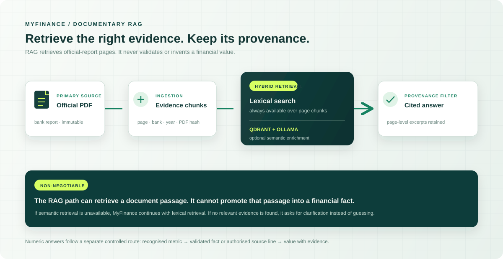

# Pipeline RAG — recherche documentaire contrôlée

## Objectif

Le RAG de MyFinance sert à retrouver des passages pertinents dans les rapports officiels. Il améliore l’accès aux documents, mais n’est pas une source de vérité financière : un extrait retrouvé ne devient jamais, à lui seul, une donnée validée.

Le système sépare donc deux parcours :

<p align="center">
  
</p>

## 1. Préparer les sources

1. Les rapports officiels sont conservés dans `data/raw/official-reports/`.
2. L’ingestion les transforme en `EvidenceChunk` : chaque chunk reste limité à une page PDF.
3. Chaque chunk conserve sa provenance : banque, année, page, chemin source et hash du PDF.
4. Le corpus normalisé est écrit sous `data/normalized/corpus/<bank>/<year>/`.

Cette limite à la page est volontaire : une réponse documentaire doit pouvoir indiquer précisément où vérifier son contenu.

## 2. Construire l’index sémantique optionnel

Le corpus page par page est toujours disponible pour la recherche lexicale. Qdrant ajoute une recherche sémantique facultative sur ce même corpus :

```text
Evidence chunks
    → embeddings locaux via Ollama / nomic-embed-text
    → collection Qdrant
    → recherche sémantique filtrée par banque et année
```

La commande suivante reconstruit l’index uniquement après un changement du corpus ou des données approuvées :

```powershell
.\scripts\myfinance.ps1 reindex
```

Qdrant ne stocke pas une nouvelle vérité financière. Il stocke des représentations vectorielles des mêmes extraits de PDF déjà présents localement.

## 3. Traiter une question documentaire

Lorsqu’une question porte sur le contenu d’un rapport — par exemple une politique de risque ou des transactions avec parties liées — le Chat suit ce parcours :

```text
Question documentaire
        |
        v
Identification de la banque et de l'année
        |
        v
Expansion contrôlée des termes métier
        |
        +-------------------------------+
        |                               |
        v                               v
Recherche lexicale                 Recherche Qdrant
par pages                          si disponible
        |                               |
        +---------------+---------------+
                        |
                        v
      Regroupement et filtrage de provenance
                        |
                        v
            Pages et extraits retenus
                        |
                        v
      Réponse explicative avec citations
```

Les garde-fous appliqués sont les suivants :

- les résultats restent limités à la banque et à l’année demandées ;
- un extrait conserve toujours sa page et son document d’origine ;
- la réponse doit rester soutenue par les extraits retenus ;
- en l’absence de passage suffisamment pertinent, le Chat demande une précision au lieu de compléter l’information par hypothèse.

La recherche vectorielle complète la recherche lexicale. Elle peut retrouver une page même si l’utilisateur n’emploie pas exactement les mots du rapport, mais elle ne remplace ni les filtres de provenance ni la citation finale.

## 4. Ce que le RAG ne fait pas

Le RAG ne doit pas :

- convertir une valeur aperçue dans un extrait en fait `auto_validated` ;
- comparer des nombres issus de passages différents sans contrôle de compatibilité ;
- répondre avec un chiffre lorsque la banque, l’année, l’unité ou le périmètre ne sont pas établis ;
- remplacer une source PDF par une réponse de Groq ou par un résultat Qdrant.

Une valeur chiffrée validée suit donc un autre parcours :

```text
Question numérique
    → détection banque + année + métrique
    → fait auto_validated correspondant
    → contrôle de l'unité, de la page et de la provenance
    → réponse chiffrée traçable
```

Pour certaines métriques hors du noyau de validation, le système peut aussi afficher une **valeur extraite directement de la ligne source** si un libellé accepté apparaît une seule fois dans l’état financier principal. Ce chemin est déterministe et distinct du RAG ; la valeur est présentée comme issue de la source, non comme un fait automatiquement validé.

## 5. Dégradations prévues

| Situation | Comportement du Chat |
| --- | --- |
| Qdrant disponible | Recherche lexicale enrichie par la recherche sémantique |
| Qdrant indisponible | Recherche lexicale par pages uniquement |
| Ollama ou modèle absent | Pas de nouvel index sémantique ; les faits validés et la recherche lexicale restent disponibles |
| Aucun extrait suffisamment pertinent | Clarification demandée à l’utilisateur |
| Fait financier absent | Pas de nombre inventé ; clarification, abstention ou valeur source déterministe si le contrat de métrique l’autorise |

## 6. Comment présenter ce pipeline en démo

Vous pouvez résumer le fonctionnement ainsi :

> « Le RAG sert à retrouver la bonne page d’un rapport officiel. Il améliore la recherche, mais ne valide pas les chiffres. Les réponses documentaires restent liées à leurs extraits, tandis que les valeurs financières suivent un parcours de validation distinct. »

Pour une démonstration, posez une question documentaire comme :

```text
Describe the related-party transactions disclosed in BIAT's 2021 report.
```

Montrez ensuite les extraits et la page associée. Expliquez que Qdrant peut aider à retrouver ce passage, mais que l’utilisateur peut toujours remonter au PDF officiel.

## Références associées

- [Architecture](architecture.md) : frontière entre preuves, RAG, réponses financières et tests.
- [Data model](data-model.md) : objets `DocumentRecord`, `EvidenceChunk` et `FinancialFact`.
- [Data coverage](data-coverage.md) : ajout contrôlé d’un rapport, d’une métrique ou d’un fait.
- [Operations guide](operations-guide.md) : commande de réindexation, Qdrant et Ollama.
