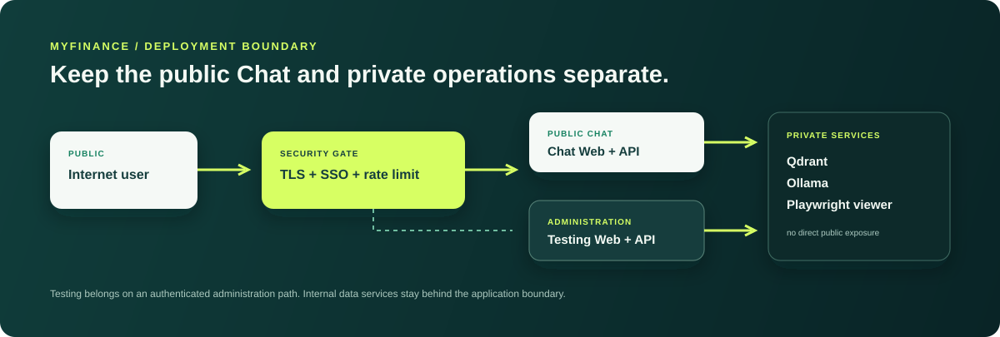

# Security and Deployment

## 1. Current security posture: local by default

MyFinance is delivered as a local application. Docker publishes the Chat, Testing, Qdrant and Playwright viewer to `127.0.0.1` by default. They are available on the workstation, not to the LAN or Internet.

This is particularly important because the Testing Lab can run campaigns, retain diagnostic evidence and delete its own local history. Qdrant and Ollama are internal data services and must not be exposed as public endpoints.

## 2. Application protections

Both APIs apply runtime protections appropriate to local use:

| Protection | Local behaviour |
| --- | --- |
| CORS | Restricted to configured local origins |
| Browser response headers | `no-store`, `nosniff`, frame denial and no-referrer behaviour |
| Host/origin policy | Production mode rejects missing or wildcard production values |
| Rate limit | Can be disabled locally; production mode requires a positive configured limit |
| Diagnostics | Detailed conversation-plan diagnostics are not intended for public exposure |
| Secret handling | Environment variables only; no key is stored in the codebase |

Local configuration belongs in `.env`:

```env
MYFINANCE_DEPLOYMENT_MODE=local
MYFINANCE_CORS_ORIGINS=
MYFINANCE_ALLOWED_HOSTS=
MYFINANCE_RATE_LIMIT_PER_MINUTE=0
```

## 3. Secrets

`GROQ_API_KEY` is the only optional external-provider secret currently used by the project. Keep it in `.env`, the host environment or a deployment secret manager.

Never place a real key in:

- source code or Markdown;
- Git commits or GitHub issues;
- screenshots, test reports or campaign artefacts;
- browser console output;
- a copied command-history export.

If a key has been exposed, revoke it at the provider, create a replacement and recreate `chat-api` and `testing-api` so they receive the new environment.

## 4. Before any Internet deployment

The production runtime checks are necessary but not sufficient. Before exposing MyFinance outside the local workstation, implement all of the following:

1. **Reverse proxy with TLS/HTTPS.** Terminate TLS at a maintained proxy; redirect HTTP to HTTPS.
2. **Authentication and authorisation.** Protect both applications. The Testing Lab should normally be restricted to administrators or an internal SSO group.
3. **Shared rate limiting.** Use the proxy or gateway, not only per-process in-memory limiting.
4. **Private internal services.** Do not publish Qdrant, Ollama, Testing API or the Playwright viewer directly.
5. **Explicit allowed origins and hosts.** Set production `MYFINANCE_CORS_ORIGINS` and `MYFINANCE_ALLOWED_HOSTS` to real domains—never `*`.
6. **Managed secrets.** Inject secrets from a vault or platform secret manager and rotate them.
7. **Observability and backups.** Centralise logs, alert on health/freshness, back up required local data and test recovery.
8. **Data governance.** Review ownership, retention and access rights for official PDFs, snapshots and campaign logs.

Example production environment shape:

```env
MYFINANCE_DEPLOYMENT_MODE=production
MYFINANCE_CORS_ORIGINS=https://app.example.com
MYFINANCE_ALLOWED_HOSTS=api.example.com
MYFINANCE_RATE_LIMIT_PER_MINUTE=60
```

## 5. Recommended production topology

<p align="center">
  
</p>

The public Chat and administrative Testing plane have different risk profiles. Keep them separate even if they share code and local source data.

## 6. Operational security checklist

- [ ] Docker ports bind to loopback or private service networks only.
- [ ] `.env` and generated reports are ignored by Git.
- [ ] The Groq key is valid, scoped and rotatable.
- [ ] Qdrant and Ollama have no public port mapping.
- [ ] Production uses HTTPS and authenticated access.
- [ ] CORS/hosts are explicit, not wildcards.
- [ ] Shared rate limiting and access logs are in place.
- [ ] Campaign history retention is intentional.
- [ ] Source PDFs and market snapshots have an approved retention policy.

## 7. What this guide does not claim

Local Docker defaults are a strong development baseline; they are not a complete enterprise-security certification. Authentication, backup, audit retention, incident response and data-classification controls must be chosen by the organisation that deploys MyFinance.

For day-to-day local operation, use the [Operations guide](operations-guide.md). For the source-trust boundary, use the [Architecture](architecture.md).
